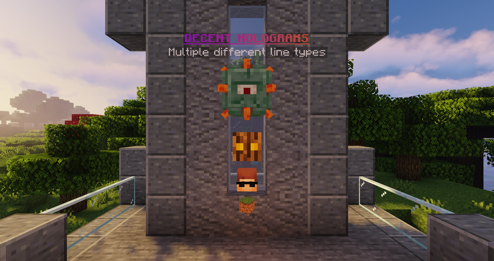

## Hologram Line Types

DecentHolograms supports various types of content for hologram lines, including text, items, and entities. If the content is not text, the type must be defined in the line's content using the following format:

> `#<type>: <content>`

{ loading="lazy" }

### Text

A text line allows you to enter any text, including PAPI placeholders, colors and animations. You can use this type of line to display dynamic and personalized information to players.

#### Example text line:

> `&fThis is a &btext line&f.`

### Icon

An Icon line displays a floating item, which can be any material, player head, PAPI placeholders, or modified NBT data.

#### Format:

> `#ICON: MATERIAL[:DATA_VALUE] [(player_name|skull_texture)] [{NBT}]`

Of course, you don't have to enter all of the parameters. Here are a few examples:

> ```
> // Red Wool (Pre 1.13):
> #ICON: WOOL:14
> 
> // Light Blue Leather Chestplate:
> #ICON: LEATHER_CHESTPLATE {display:{color:3847130}}
> 
> // d0by's head (1.13+, use SKULL_ITEM in older versions):
> #ICON: PLAYER_HEAD (d0by)
> ```

### Head

Head lines are displayed as a helmet of a normal-size armor stand.  
Format is the same as for [Icons](#icon) except that you start with `#HEAD:` and not `#ICON`.

#### Examples:

> ```
> // d0by's head (1.13+, use SKULL_ITEM in older versions):
> #HEAD: PLAYER_HEAD (d0by)
> 
> // Grass Block
> #HEAD: GRASS_BLOCK
> ```

### Small Head

The same thing as [Head](#head) but on a small armor stand.  
Line also starts with `#SMALLHEAD`.

### Entity

Yes, you can even display entities. All entity types can be found [here](https://hub.spigotmc.org/javadocs/bukkit/org/bukkit/entity/EntityType.html){ target="_blank" rel="noreferral" }.

!!! note "Limitations"
    Not all entities will work on all server versions.  
    In addition does DecentHolograms **not** allow a collection of specific entities. A list of those can be found [here](https://github.com/DecentSoftware-eu/DecentHolograms/blob/main/src/main/java/eu/decentsoftware/holograms/api/utils/entity/DecentEntityType.java){ target="_blank" rel="noreferral" }.

#### Format: { #format-entity }

> `#ENTITY: ENTITY_TYPE`

#### Examples: { #examples-entity }

> ```
> #ENTITY: PIG
> #ENTITY: AXOLOTL
> ```

## Additional Information

It's important to note that certain materials and entity types may only be available on specific server versions. For example, using the Entity Type AXOLOTL on a 1.8 server will not work. Be sure to check the compatibility of the materials and entity types you wish to use with your server versions.

### Player Heads

There are three methods to create player heads, all of which are shown in the examples below.

!!! note "Notes"
    - The examples below use the [Icon](#icon) format but they also work with the [Head](#head) and [Small Head](#small-head) formats.
    - `PLAYER_HEAD` needs to be replaced with `SKULL_ITEM` on Servers running 1.12 or older.

#### Player Name:

> ```
> #ICON: PLAYER_HEAD (d0by)
> ```

#### Per-Player Head

Displays the head of the player looking at the hologram.

> ```
> // {player} placeholder from DecentHolograms
> #ICON: PLAYER_HEAD ({player})
> 
> // %player_name% from PlaceholderAPI
> #ICON: PLAYER_HEAD (%player_name%)
> ```

#### Texture

You can use a Base64 String texture.

> ```
> #ICON: PLAYER_HEAD (eyJ0ZXh0dXJlcyI6eyJTS0lOIjp7InVybCI6Imh0dHA6Ly90ZXh0dXJlcy5taW5lY3JhZnQubmV0L3RleHR1cmUvODE2ZjAwNzNjNTg3MDNkOGQ0MWU1NWUwYTNhYmIwNDJiNzNmOGMxMDViYzQxYzJmMDJmZmUzM2YwMzgzY2YwYSJ9fX0=)
> ```