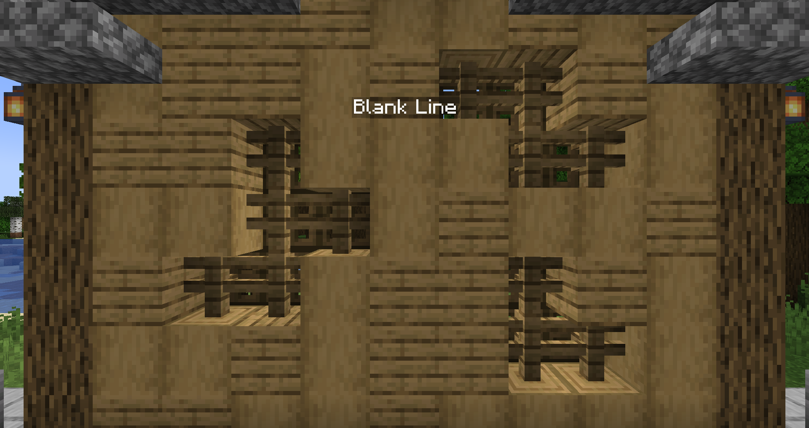
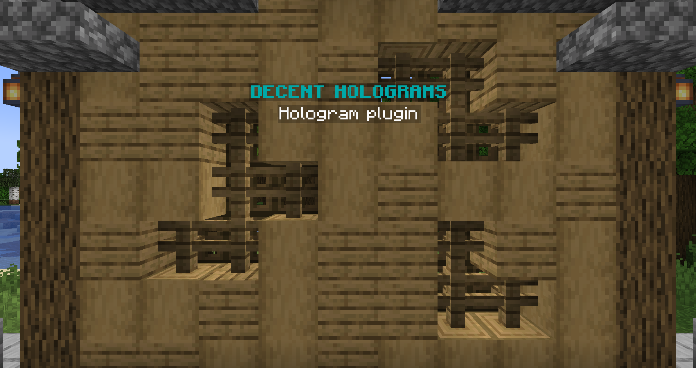

## Permissions

DecentHolograms is a plugin specifically designed for server administrators and as such, it simplifies permissions by requiring only one permission node, `dh.admin`, to access all of its features and functionality.

## Commands

With a wide range of commands, effectively utilizing this plugin may require a basic understanding of some general rules. This will be helpful to work with the commands effectively.

### Arguments

Parenthesis only specifiy the type of an argument, they are **not** part of the final command.

| Parenthesis | Meaning                  |
|-------------|--------------------------|
| `<>`        | Required argument.       |
| `[]`        | Optional argument.       |
| `{}`        | List of possible values. |

### Tab Completion

The majority of commands and sub-commands feature tab-completion functionality, which can be used to quickly type commands and determine valid values for arguments.

## Editing Holograms

This tutorial provided a basic guide for editing holograms, including instructions for creating and modifying them. For a complete list of commands, please refer to [this page]().

### Create a Hologram [[More]]() { #create-a-hologram }

Creating a hologram is easy, simply use the command below to get started.

> `/dh create <name> [initial content]`

!!! tip
    By default, the hologram will spawn with a single line that reads "Blank Line". You can change the default line content in the [config.yml]() file or specify the content in the command as shown in the example provided.

### Edit lines [[More]]() { #edit-lines }

A full list of possible line types and content for hologram lines can be found on [this page]().

#### Add a line

> `/dh line add <hologram> <page> <content>`

#### Set a line

> `/dh line set <hologram> <page> <line> <content>`

#### Remove a line

> `/dh line remove <hologram> <page> <line>`

### Edit pages [[More]]() { #edit-pages }

#### Add a page

> `/dh page add <hologram> [initial content]`

#### Remove a page

> `/dh page remove <hologram> <page>`

#### View a page

> `/dh page switch <hologram> <page>`

## Hologram Creation Example

Here is an example of how to create a new hologram with multiple lines and pages using the available commands.

### Create the hologram

> `/dh create example`

{ loading="lazy" }

### Edit lines

> `/dh line set example 1 1 &3&lDECENT HOLOGRAMS`  
> `/dh line add example 1 &fHolograms plugin`

{ loading="lazy" }

### Add another page

You can have as many pages as you'd like.

> `/dh page add example`  
> `/dh page switch example 2`

{ loading="lazy" }

### Setup actions

To allow players to navigate between pages, you can simply do this:

> `/dh page addaction example 1 RIGHT NEXT_PAGE`  
> `/dh page addaction example 2 LEFT PREV_PAGE`

By setting up appropriate click actions, players can navigate between the pages by right-clicking the first page to switch to the next page, and left-clicking the second page to switch back to the first page.

#### You can also switch to a specific page { #switch-to-specific-page }

> `/dh page addaction example 2 RIGHT PAGE:1`

We offer a variety of click actions, all of which are explained in detail on [this page]().

## Conclusion

That concludes the basic overview of how to use DecentHolograms. The plugin offers many more advanced features and functionality, all of which can be found in the command reference page. If you need any assistance, please don't hesitate to reach out to us on our Discord channel.